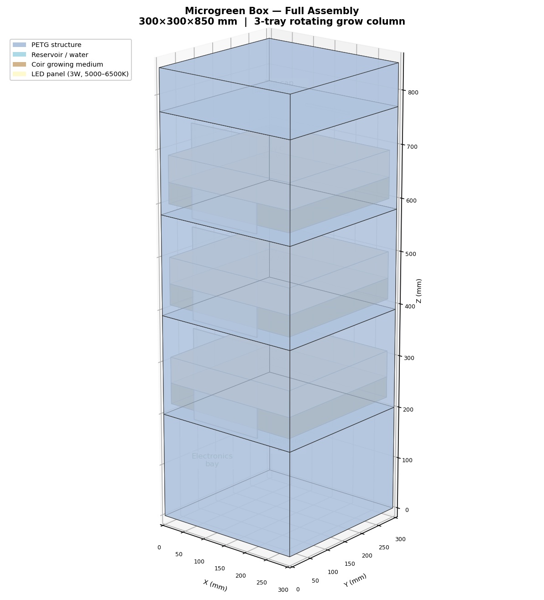
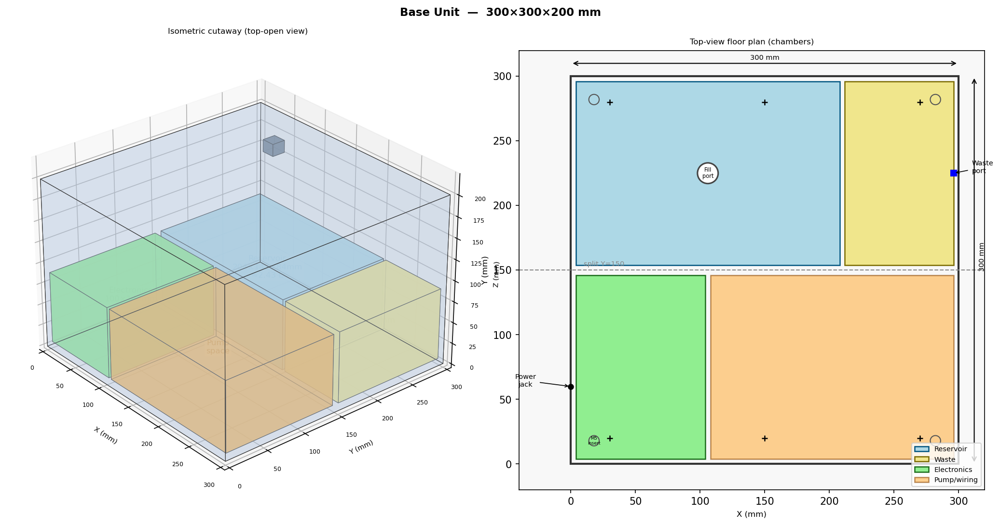
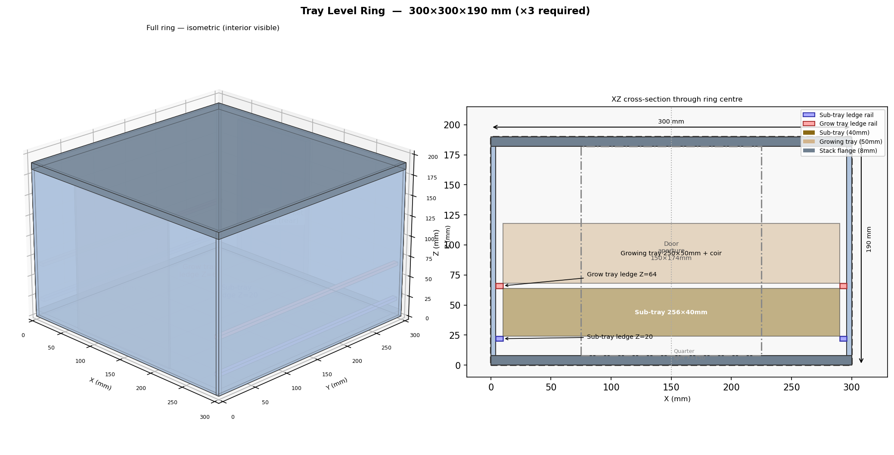
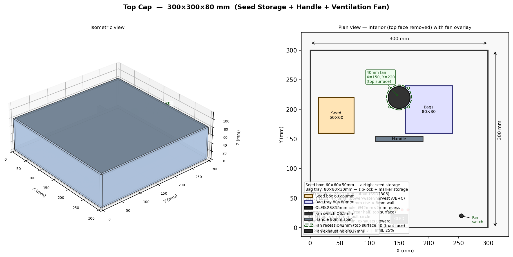
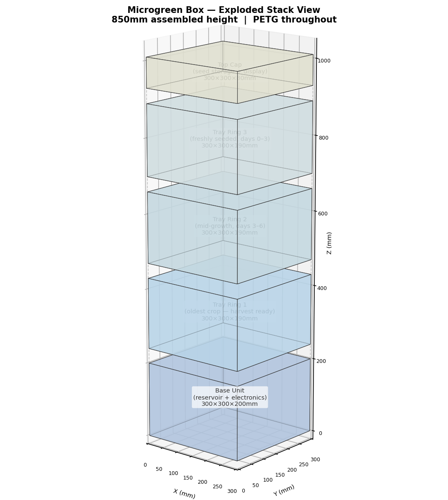

# Microgreen Box

**An open-source, automated device that grows broccoli microgreens daily — on solar power, in a vehicle, or at home.**



Broccoli microgreens contain up to 100× more sulforaphane than mature broccoli — one of the most-studied anti-cancer, anti-inflammatory compounds in food. This device automates the full grow cycle so you harvest 30 g of fresh greens every morning without daily attention.

---

## What it produces

| Output | Value |
|--------|-------|
| Species | Broccoli (*Brassica oleracea* var. *italica*) |
| Daily yield | 30 g/day (up to 60 g/day with 4 trays) |
| Sulforaphane dose | ~200 µmol/day (upper end of clinically studied range) |
| Grow cycle | 10 days seed-to-harvest |
| Rotation | 3 trays staggered; harvest one tray every ~3 days |
| Consumption | Raw in a morning smoothie (blending maximises sulforaphane) |

---

## Key features

- **Fully automated** — timed LED lighting, twice-daily moisture-feedback watering, harvest alert
- **12V DC power** — runs on solar + LiFePO4 battery, vehicle 12V, or a mains adapter
- **Vehicle-compatible** — sealed water system, no open surfaces, wide low-CG base
- **3D-printable** — all parts fit on a 200×200mm print bed; ~2.5 kg PETG
- **ESP32 firmware** — Arduino framework, light-sleep power management, optional OLED display, serial debug
- **Modular** — add a 4th tray ring to double output; no other changes needed
- **Open hardware** — full OpenSCAD parametric models, wiring schematics, BOM with vendor links

---

## Renders

| | |
|---|---|
|  |  |
| *Base unit — reservoir, waste chamber, electronics bay* | *Tray ring — one per grow level* |
|  |  |
| *Top cap — seed storage, OLED, ventilation fan* | *Exploded view — all 5 vertical sections* |

Additional renders: [hardware/3d-models/renders/](hardware/3d-models/renders/)

---

## What you need to build one

### Electronics (~$65)

| Component | Qty | ~Cost |
|-----------|-----|-------|
| ESP32-WROOM-32 dev board | 1 | $5 |
| DS3231 RTC module | 1 | $2 |
| SSD1306 OLED display (optional) | 1 | $3 |
| MP1584EN 12V→5V buck converter | 1 | $2 |
| 4-channel relay module (JD-VCC isolated) | 1 | $3 |
| 12V peristaltic pump | 1 | $10 |
| 12V full-spectrum LED grow strips | 1 roll | $12 |
| Capacitive soil moisture sensors V1.2 | 3 | $4 |
| ZP2508 float switch | 1 | $1 |
| 40mm 12V brushless fan | 1 | $3 |
| Misc (wire, connectors, LEDs, resistors, fuse) | — | ~$20 |
| **Electronics total** | | **~$65** |

Full BOM with exact part links and vendor SKUs: [bom/bill-of-materials.csv](bom/bill-of-materials.csv)

### 3D-printed parts (~$50–62 filament)

~2.5 kg PETG filament, ~71.5 print-hours. All parts fit on a 200×200mm print bed.

**Pre-built STL files are included** in [`hardware/3d-models/stl/`](hardware/3d-models/stl/) — 20 files ready to print or upload to a print service. You do not need to install OpenSCAD to get the parts made.

**Option A — Order from a 3D print service (no printer required):**
1. Download the STL files from [`hardware/3d-models/stl/`](hardware/3d-models/stl/)
2. Upload to a service such as [Craftcloud](https://craftcloud3d.com), [JLCPCB](https://3d.jlcpcb.com), [Treatstock](https://www.treatstock.com), or a local print shop / library makerspace
3. Select **PETG** material — do not substitute PLA (it warps in hot vehicles)
4. Use the quantities listed in [`docs/03-build/printing-instructions.md`](docs/03-build/printing-instructions.md)

**Option B — Print yourself:**
See [docs/03-build/printing-instructions.md](docs/03-build/printing-instructions.md) for slicer settings. To regenerate STLs from source (only needed if you modify the design):
```bash
sudo apt install openscad
cd hardware/3d-models
make all          # regenerates all STL files in hardware/3d-models/stl/
```

### Hardware and consumables (~$30)

M3/M5 fasteners, RTV silicone, foam weather-strip, magnetic door catches, XTC-3D epoxy (waterproofing), anti-slip feet.
Broccoli seeds (~100 g/month), compressed coir pucks (3×/month).

### Optional: off-grid solar (~$100–155 additional)

40W solar panel + 20Ah LiFePO4 battery + 10A MPPT charge controller.
Average system load: ~6.6W. A 40W panel breaks even at 4 peak sun hours/day.

---

## Getting started

### 1. Read the documentation

In order:

1. [docs/02-design/system-architecture.md](docs/02-design/system-architecture.md) — how all subsystems connect
2. [docs/03-build/printing-instructions.md](docs/03-build/printing-instructions.md) — 3D printing all parts
3. [docs/03-build/assembly-instructions.md](docs/03-build/assembly-instructions.md) — 20-step build guide (written for beginners)
4. [hardware/schematics/wiring-schematic.md](hardware/schematics/wiring-schematic.md) — complete wiring reference
5. [docs/04-software/installation-guide.md](docs/04-software/installation-guide.md) — firmware setup
6. [docs/04-software/user-manual.md](docs/04-software/user-manual.md) — daily operation

### 2. Get the parts printed

**Ready-to-use STL files are in [`hardware/3d-models/stl/`](hardware/3d-models/stl/).** Upload these directly to a print service or open them in your slicer — no software installation needed.

**No printer?** Upload the STL files to an online 3D print service (Craftcloud, JLCPCB 3D, Treatstock, or a local print shop). Select **PETG** — do not substitute PLA. See [printing-instructions.md](docs/03-build/printing-instructions.md) for the quantity of each file to order and per-part infill settings to specify.

**Have a printer?** Open the STL files in PrusaSlicer, Bambu Studio, or Cura. Use 40% infill for structural parts, 4 perimeters, 6 top/bottom layers, PETG profile. Post-process reservoir and sub-tray interiors with XTC-3D epoxy for water-tightness. Full settings in [printing-instructions.md](docs/03-build/printing-instructions.md).

### 3. Wire the electronics

Follow the [assembly instructions](docs/03-build/assembly-instructions.md) step by step.
The [wiring schematic](hardware/schematics/wiring-schematic.md) has a complete wire-by-wire connection table (40+ rows).

Critical points:
- Remove the JD-VCC shorting jumper on the relay module **before** installation
- All three moisture sensor ADC pins must be on ADC1 (GPIO32/34/35) — ADC2 is disabled when WiFi is active on ESP32
- The 12V→5V buck converter powers both the ESP32 logic rail and the relay coil supply rail

### 4. Flash the firmware

```bash
# Install Arduino IDE 2.x
# Add ESP32 board support (Espressif boards URL in Preferences)
# Install via Library Manager: RTClib, Adafruit GFX, Adafruit SSD1306

# Open: software/firmware/microgreen_controller/microgreen_controller.ino
# Edit config.h for your pump flow rate and time zone offset
# Select "ESP32 Dev Module", upload to board
```

Set the clock once via serial monitor (115200 baud):

```
T1708300800    ← replace with current Unix timestamp
```

Full setup guide: [docs/04-software/installation-guide.md](docs/04-software/installation-guide.md)

### 5. Seed your first tray

1. Fill reservoir through the top fill port (2.4 L capacity, ~13 days autonomy)
2. Press the button once — three green LED flashes confirm Tray A is seeded
3. The device manages lights and watering automatically
4. On Day 8, the red harvest LED lights and the buzzer sounds — harvest and blend

Full operation guide: [docs/04-software/user-manual.md](docs/04-software/user-manual.md)

---

## Project structure

```
microgreen-box/
├── README.md                             ← you are here
├── CONTRIBUTING.md                       ← how to contribute
├── PROJECT_DECISIONS.md                  ← design decisions log (start here)
├── bom/
│   └── bill-of-materials.csv            ← 85-item BOM with vendor links and prices
├── docs/
│   ├── 01-research/                     ← nutritional research, production targets
│   ├── 02-design/                       ← system architecture, all subsystem designs
│   ├── 03-build/                        ← printing instructions, 20-step assembly guide
│   └── 04-software/                     ← firmware requirements, install guide, user manual
├── hardware/
│   ├── 3d-models/
│   │   ├── source/                      ← OpenSCAD parametric models
│   │   │   ├── params.scad              ← master dimensions (edit here first)
│   │   │   ├── base_unit.scad
│   │   │   ├── tray_ring.scad
│   │   │   ├── growing_tray.scad
│   │   │   ├── sub_tray.scad
│   │   │   ├── led_bracket.scad
│   │   │   ├── tray_door.scad
│   │   │   ├── top_cap.scad
│   │   │   └── misc_parts.scad
│   │   ├── stl/                         ← generated STL files (run `make all`)
│   │   ├── renders/                     ← PNG technical diagrams of all parts
│   │   ├── Makefile                     ← generates STLs from SCAD sources
│   │   └── render_models.py             ← generates PNG renders (matplotlib)
│   ├── schematics/
│   │   └── wiring-schematic.md          ← complete wiring reference
│   └── LICENSE                          ← CERN-OHL-S v2 (hardware)
└── software/
    ├── firmware/
    │   └── microgreen_controller/
    │       ├── microgreen_controller.ino ← main firmware sketch
    │       └── config.h                  ← all user-adjustable parameters
    └── LICENSE                           ← MIT (software/firmware)
```

---

## Design specifications

| Parameter | Value |
|-----------|-------|
| Enclosure footprint | 300 × 300 mm |
| Enclosure height (3-tray) | 850 mm |
| Tray size | 250 × 250 mm |
| Tray count | 3 (expandable to 4 by adding a ring) |
| Growing medium | Coconut coir |
| Reservoir capacity | 2.4 L (~13 days autonomy) |
| Pump | 12V peristaltic, top-drip, 25 mL/tray/event |
| Watering schedule | Twice daily (07:00 + 19:00), moisture-feedback |
| Lighting | 3W full-spectrum LED per tray, 14h/day |
| Power input | 12V DC (5.5/2.1mm barrel jack) |
| Average power draw | ~6.6W |
| Peak power draw | ~17W (all LEDs + fan) |
| Microcontroller | ESP32-WROOM-32 (Arduino framework) |
| Enclosure material | PETG (food-safe, heat-resistant to 80°C) |
| Total build cost | ~$95 electronics + $55 filament ≈ **$150** |

---

## Firmware quick reference

All parameters in `software/firmware/microgreen_controller/config.h`:

| Parameter | Default | Description |
|-----------|---------|-------------|
| `PHOTO_ON_HOUR` | 6 | Lights on (24h clock) |
| `PHOTO_OFF_HOUR` | 20 | Lights off |
| `BLACKOUT_DAYS` | 2 | Germination darkness days per tray |
| `GERMINATION_WATER_DAYS` | 2 | Watering exclusion window (days 0–N) |
| `WATER_HOUR_1` | 7 | First daily watering event |
| `WATER_HOUR_2` | 19 | Second daily watering event |
| `GROW_DAYS` | 10 | Full grow cycle length |
| `HARVEST_DAY` | 8 | Day harvest alert activates |
| `PUMP_RUN_SECONDS` | 90 | Pump run time — **calibrate to your pump** |
| `MOISTURE_SKIP_THRESHOLD` | 70 | Skip watering if moisture above this % |
| `MOISTURE_TOPUP_THRESHOLD` | 25 | Extra pump run if moisture below this % |

Serial commands (115200 baud): `T<epoch>` sets RTC clock, `S` dumps full device status.

---

## Nutrition context

Broccoli microgreens at 30 g/day provide approximately:

- **~200 µmol sulforaphane potential** (via glucoraphanin + myrosinase, activated by blending)
- Clinical studies typically use 50–150 µmol/day for anti-inflammatory and chemoprotective effects
- 10–100× more sulforaphane per gram than mature broccoli
- Must be consumed raw — myrosinase enzyme is destroyed above ~70°C

For maximum sulforaphane: blend fresh (or blend from frozen — raw home freezing increases yield up to 3.1×).

Research background: [docs/01-research/](docs/01-research/)

---

## License

This project uses a dual licence:

| Component | Licence |
|-----------|---------|
| Hardware (3D models, schematics) in `hardware/` | [CERN-OHL-S v2](hardware/LICENSE) |
| Software/firmware in `software/` | [MIT](software/LICENSE) |
| Documentation in `docs/` | [CC-BY-SA 4.0](https://creativecommons.org/licenses/by-sa/4.0/) |

The CERN-OHL-S licence is **strongly reciprocal**: if you build modified hardware and distribute it, you must publish the modified source files under the same licence.

---

## Contributing

Bug reports, build logs, and improvements welcome. See [CONTRIBUTING.md](CONTRIBUTING.md).
